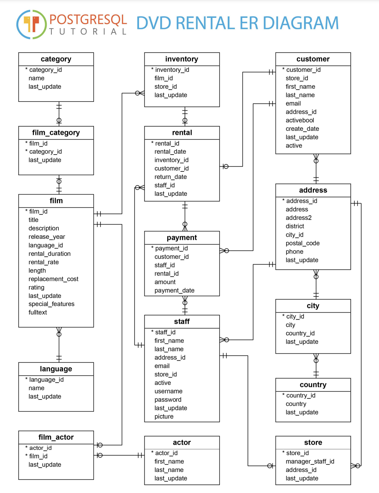

# Java Technical Exercise

We would like you to implement a film recommendation service on top of the PostgreSQL DVD rental sample database.



## Requirements

The objective of this exercise is to implement an application that returns a list of 10 film recommendations for a given customer.
The `customer_id` of the target customer can be passed as the input.

## Getting started

To complete this exercise, you will need Docker Engine installed and accessible from your path.

We have provided a bootstrapped Spring Boot project which you are free to use as a starting point if you wish. If preferred please feel free to start from scratch - we only ask that the solution provided is created with Java 21.
You can use any libraries that you would normally use.

To initialize the PostgreSQL database, we have provided a Dockerfile:

```shell
docker build -t dvdrental .
docker run -p 5432:5432 --name dvdrental -d dvdrental
```

PostgreSQL will then be accessible locally on port 5432 or whatever you choose above.

You can verify that the database has been loaded by connecting to the container and using `psql`:

```shell
docker exec -ti dvdrental psql -U postgres -d dvdrental -h localhost -c '\dt;'
#              List of relations
#  Schema |     Name      | Type  |  Owner   
# --------+---------------+-------+----------
#  public | actor         | table | postgres
#  public | address       | table | postgres
#  public | category      | table | postgres
#  public | city          | table | postgres
#  public | country       | table | postgres
#  public | customer      | table | postgres
#  public | film          | table | postgres
#  public | film_actor    | table | postgres
#  public | film_category | table | postgres
#  public | inventory     | table | postgres
#  public | language      | table | postgres
#  public | payment       | table | postgres
#  public | rental        | table | postgres
#  public | staff         | table | postgres
#  public | store         | table | postgres
# (15 rows)
```

### Output

Exactly ten films must be returned as a JSON array. Each JSON film object must have the following properties:

| JSON property | Database column    |
|---------------|--------------------|
| `id`          | `film.film_id`     |
| `title`       | `film.title`       |
| `description` | `film.description` |
| `category`    | `category.name`    |
| `rating`      | `film.rating`      |
| `length`      | `film.length`      |

The films must be returned in the following order:

1. (primary) In descending order, the number (i.e. count) of films that the target customer has rented with the same `category` as this film
2. (secondary) In descending order, the number (i.e. count) of times that this film has been rented across all customers
3. (tertiary) In ascending order, `title` alphabetically

The limit of ten must be applied after this ordering has been applied to the full result set.

Films that have already been rented by the target customer must be omitted from the list of recommendations.

The expected output for `customer_id 1` can be viewed [here](customer-1-recommended-films.json). This example has been formatted for readability, but doing so is not a requirement.

### Assessment

Good documentation to get us started and understand your solution is important.

Your project must build and run on Linux x86 or macOS ARM64.

How you run the solution is up to you - a simple command line/stdout solution is perfectly fine; a Docker image can be provided if desired. We just ask that you include clear instructions on how to run the application.

Tests to prove your solution are vital.


Note: please do not fork this repository or submit answers as a public pull request. Please zip and send your repo over email or via file upload.
